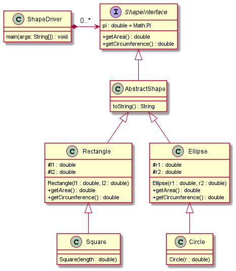
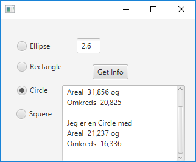

# Polymorphism

## Tasks - Arv, Interface og Polymorphism
Udleveret kodeskelet:
- ShapeInterface.java
- AbstractShape.java
- ShapeDriver.java

Der skal implementeres 4 klasser på baggrund af dette klasse diagram:




### Task a - Ellipse og Rectangel
Disse formler kan benyttes til `getArea()` og `getCirrumference()`:

|         | Ellipse                                            | Rectangel       |
| ------- | -------------------------------------------------- | --------------- |
| Area    | _π * r1 * r2_                                      | _l1 * l2_       |
| Omkreds | _2 * π * √(½ * (r1<sup>2</sup> + r2<sup>2</sup>))_ | _2 * (l1 + l2)_ |

### Task b - Circle og Square

Disse to klasser skal skrives med så lidt kode som muligt, idet det kan udnyttes at en cirkel er et specialtilfælde
af en ellipse med r1 = r2 og at et kvadrat er et specialtilfælde af et rektangel med l1 = l2.

Når `ShapeDriver` eksekveres skal udskriften ligne det her:
```
Shapes: [
Jeg er en Circle med Areal 36,317 og Omkreds 21,363,
Jeg er en Rectangle med Areal 14,960 og Omkreds 15,600,
Jeg er en Ellipse med Areal 28,840 og Omkreds 19,289,
Jeg er en Square med Areal 11,560 og Omkreds 13,600]
```

### Task c (ekstra) - GUI og Singleton Facade
Udleveret kode indeholder også et kodeskelet til en Facade klasse:
- ShapeFacade.java

Dette er den eneste klasse som må tilgås fra GUI’en. Singleton mønsteret er implementeret, så der højest er én
instance, som kun kan tilgås vha. `getInstance()`-metoden.

Til at skelne mellem de fire konkrete `Shapes`, indeholder klassen desuden:
```java
public enum SHAPES {
    CIRCLE, ELLIPSE, RECTANGLE, SQUERE
};
```

`SHAPES` kan tilgås statisk fra andre klasser (fx `ShapeFacade.SHAPES.CIRCLE`).

### Task d - getShapeInfo() metoden

Implementer metoden
```java
public String getShapeInfo(SHAPES shape, double... parametre) {
    throw new UnsupportedOperationException("Not supported yet.");
}
```
 
Så der oprettes en instance af `shape` med én (`Circle`, `Square`) eller to (`Ellipse`, `Rectangle`) parametre.

Metoden skal returner den pågældendes `toString()`.

### Task e -  Så skal vi have noget GUI
Brugerfladen skal se nogenlunde sådan her ud:




Der er:
- __4__ `RadioButtons` til valg af `Shape`.
- __2__ `TextFields` til parametre. Kun det ene er synligt når der vælges `Circle` eller `Square`.
- __1__ `TextArea` til resultater
- __1__ `Button` til at kalde domain-laget.

Implementer en `ActionHandler` på de fire `RadioButtons`, så ét eller begge `TextFields` er synlige.

* _Hint_: I FXMLControllerens `initialize()`-metode kan de enkelte `RadioButtons` tildeles `UserData`. Fx enum-værdierne fra Facaden: `ellipseRadio.setUserData(ShapeFacade.SHAPES.ELLIPSE);`
  
  Kan derefter tilgås med fx: `ShapeFacade.SHAPES shape = (ShapeFacade.SHAPES)ShapeToggle.getSelectedToggle().getUserData();`

Implementer en `ActionHandler` på Get _Info_-knappen, så Facaden kaldes med:
`ShapeFacade.getInstance().getShapeInfo(shape, new double[]{p1});` (Circle/Square) eller
`ShapeFacade.getInstance().getShapeInfo(shape, new double[]{p1, p2});` (Ellipse/Rectangle)

Resultatet skrives I TextArea’et.

Hvis I ikke når det hele under lektion 1, bedes den færdiggjort til Lektion 2. God fornøjelse.